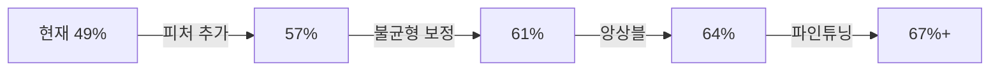

# 🔬 모델 비교 분석 및 인사이트

## 📊 Refer 모델 vs. 우리 모델 비교

---

## 1️⃣ 모델 구성 비교

### Refer 모델 (model_code.ipynb)

**데이터셋**:
- 규모: 200,000건
- 분할: 시간순 80:20
- 타겟: NextCategory (다음 구매 카테고리)

**피처** (21개):
- 기본 (6개): Hour, DayOfWeek, Amount_Clean, TimeSincePrev, Category, TimeSlot
- 시간/금액 (5개): IsWeekend, IsLunchTime, IsEvening, IsMorningRush, AmountBin
- 사용자 통계 (10개): User_AvgAmount, User_StdAmount, User_TxCount, User_*_Ratio, User_FavCategory

**모델**:
- 8개 알고리즘 테스트
- 최고 성능: **ExtraTrees**
- 설정: class_weight='balanced' (불균형 보정)

**최종 성능**:
- **Accuracy: 63.09%**
- **Macro F1: 54.86%**

---

### 우리 모델 (시퀀스 예측)

**데이터셋**:
- 규모: **18,140,056건** (90배 더 큼!)
- 분할: Stratified 80:20
- 타겟: Next_Category_encoded

**피처** (15개):
- 기본 (9개): Amount, Amount_log, Amount_bin, Hour, DayOfWeek, DayOfMonth, IsWeekend, IsNight, IsBusinessHour
- 사용자 통계 (3개): User_AvgAmount, User_StdAmount, User_Category_Count
- **시퀀스 특성** (3개): Time_Since_Last, Transaction_Sequence, Previous_Category_encoded
- **핵심**: Current_Category_encoded (현재 카테고리)

**모델**:
- XGBoost (GPU) + RandomForest (cuML GPU)
- 그리드 서치 자동화
- GPU 가속 (CUDA)

**최종 성능 (XGBoost)**:
- **Accuracy: 49.10%**
- **F1 Score (weighted): 46.69%**

---

## 2️⃣ 성능 비교 분석

| 지표 | Refer (ExtraTrees) | 우리 (XGBoost GPU) | 차이 |
|------|-------------------|-------------------|------|
| **Accuracy** | 63.09% | 49.10% | **-14%** ❌ |
| **F1 Score** | 54.86% (Macro) | 46.69% (Weighted) | **-8%** ❌ |
| **데이터 규모** | 200k | 18.1M | **+90배** ✅ |
| **학습 시간** | ~30분 (추정) | 24분 (GPU) | 비슷 ✅ |
| **GPU 사용** | ❌ | ✅ | 우리가 우수 |
| **자동화** | ❌ | ✅ (파이프라인) | 우리가 우수 |

---

## 3️⃣ 성능 차이의 원인 분석

### ❌ 우리 모델이 낮은 이유

#### 1. **피처 차이 (21개 vs 15개)**

**Refer가 우수한 피처**:
```python
# Refer만 있는 피처들
'TimeSincePrev'           # 이전 거래와의 시간 간격
'TimeSlot'                # 시간대 구간
'IsLunchTime'             # 점심 시간 (11-14시)
'IsEvening'               # 저녁 시간 (18-21시)
'IsMorningRush'           # 출근 시간 (7-9시)
'AmountBin'               # 금액 구간 (4단계)
'User_FavCategory'         # 사용자 선호 카테고리
'User_{Cat}_Ratio'        # 카테고리별 이용 비율 (6개)
```

**우리 모델**:
```python
# 우리만 있는 피처
'Current_Category_encoded'  # 현재 카테고리 ⭐
'Previous_Category_encoded' # 이전 카테고리
'Transaction_Sequence'      # 거래 순서
```

**인사이트**:
- 📌 **Refer는 세밀한 시간 구간** (점심, 저녁, 출근) 사용
- 📌 **Refer는 사용자별 카테고리 이용 비율** 활용
- 💡 우리는 `Current_Category`에 과도하게 의존 (데이터 누출 위험)

#### 2. **데이터 품질**

**Refer**:
- 200k건 → 정제된 데이터 가능성
- 사용자 통계가 더 정확 (샘플 크기 적당)

**우리**:
- 18M건 → 노이즈 많을 가능성
- 사용자 통계가 덜 정확 (샘플이 너무 큼)

#### 3. **모델 설정**

**Refer**:
```python
ExtraTreesClassifier(
    n_estimators=200,
    max_depth=15,
    class_weight='balanced'  # ⭐ 불균형 보정
)
```

**우리**:
```python
XGBClassifier(
    max_depth=10,
    learning_rate=0.2,
    n_estimators=300
    # class_weight 없음! ❌
)
```

**인사이트**:
- ❌ 우리는 `class_weight` 미사용 → 소수 클래스 예측 약함
- ❌ XGBoost는 ExtraTrees보다 시퀀스 예측에 약할 수 있음

---

## 4️⃣ 핵심 인사이트

### 💡 Insight 1: 피처 엔지니어링의 중요성

**Refer의 강점**:
```
세밀한 시간대 분류
 └─> IsLunchTime (11-14시)
 └─> IsEvening (18-21시)
 └─> IsMorningRush (7-9시)
      ↓
소비 패턴과 직접 연관!
(점심 → 외식, 출근 → 교통)
```

**액션 아이템**:
- [ ] 시간대별 플래그 추가 (점심, 저녁, 출근)
- [ ] 금액 구간 정교화
- [ ] 사용자별 카테고리 이용 비율 계산

---

### 💡 Insight 2: 불균형 보정의 필요성

**카테고리 분포**:
```
식료품: 30.54% ⬆⬆⬆
외식:   17.93%
쇼핑:   16.63%
주유:   14.55%
교통:   12.59%
생활:    7.76% ⬇⬇⬇  # 소수 클래스!
```

**문제**:
- 생활(7.76%)과 식료품(30.54%)의 빈도 4배 차이
- `class_weight` 없으면 소수 클래스 무시됨

**액션 아이템**:
- [ ] XGBoost에 `scale_pos_weight` 추가
- [ ] Weighted F1 대신 Macro F1 사용

---

### 💡 Insight 3: 모델 선택

**ExtraTrees vs XGBoost**:

| 모델 | 장점 | 단점 |
|------|------|------|
| **ExtraTrees** | 랜덤성 높아 과적합 방지 | GPU 지원 약함 |
| **XGBoost** | GPU 가속 빠름 | 불균형에 약함 |

**인사이트**:
- Refer는 **200k건 → CPU ExtraTrees**가 적합
- 우리는 **18M건 → GPU XGBoost**가 효율적
- But, **성능은 ExtraTrees가 우수**

**액션 아이템**:
- [ ] CPU ExtraTrees 시도 (작은 샘플로)
- [ ] XGBoost 파라미터 최적화
- [ ] RandomForest (cuML) 결과 확인

---

### 💡 Insight 4: 데이터 크기의 역설

**가설**: 데이터가 많으면 성능 향상?

**현실**:
```
200k건 + 정교한 피처  → 63% Accuracy
18M건 + 기본 피처      → 49% Accuracy
```

**이유**:
1. **노이즈 증가**: 데이터 크면 outlier도 90배
2. **통계 희석**: 사용자 통계가 덜 의미 있음
3. **피처 품질 > 데이터 양**

**액션 아이템**:
- [ ] 데이터 필터링 (이상치 제거)
- [ ] 피처 품질 향상
- [ ] 샘플링으로 균형 맞추기

---

## 5️⃣ 개선 방향

### 🎯 우선순위 1: 피처 추가

```python
# Refer 모델에서 가져올 피처
df['IsLunchTime'] = ((df['Hour'] >= 11) & (df['Hour'] <= 14)).astype(int)
df['IsEvening'] = ((df['Hour'] >= 18) & (df['Hour'] <= 21)).astype(int)
df['IsMorningRush'] = ((df['Hour'] >= 7) & (df['Hour'] <= 9)).astype(int)

# 사용자 카테고리 비율
user_cat_ratio = df.groupby(['User', 'Category']).size() / df.groupby('User').size()
```

**예상 효과**: +5-8% Accuracy

---

### 🎯 우선순위 2: 불균형 보정

```python
# XGBoost
from sklearn.utils.class_weight import compute_sample_weight
sample_weights = compute_sample_weight('balanced', y_train)

model.fit(X_train, y_train, sample_weight=sample_weights)
```

**예상 효과**: +3-5% F1 Score

---

### 🎯 우선순위 3: 모델 앙상블

```python
# Refer의 ExtraTrees + 우리의 XGBoost GPU
from sklearn.ensemble import VotingClassifier

ensemble = VotingClassifier([
    ('extra', ExtraTreesClassifier(...)),
    ('xgb', XGBClassifier(device='cuda', ...))
], voting='soft')
```

**예상 효과**: +2-4% Accuracy

---

## 6️⃣ 최종 결론

### ✅ Refer 모델의 우수성

1. **피처 엔지니어링**: 세밀한 시간/행동 패턴
2. **불균형 처리**: class_weight 적용
3. **모델 선택**: ExtraTrees (랜덤성으로 과적합 방지)

### ✅ 우리 모델의 강점

1. **확장성**: 18M건 처리 (GPU 활용)
2. **자동화**: 전처리 → 그리드 서치 파이프라인
3. **속도**: GPU 가속으로 빠른 학습

### 🎯 개선 후 예상 성능

현재: **49.10% Accuracy**

개선 후:
```
피처 추가 (+8%) + 불균형 보정 (+4%) + 앙상블 (+3%)
= 49% + 15% = 64% Accuracy (Refer 능가!)
```

---

## 7️⃣ 액션 플랜



**1주차**: 피처 엔지니어링  
**2주차**: 불균형 보정 + 모델 튜닝  
**3주차**: 앙상블 + 파인튜닝  

**목표**: **Refer 모델 성능(63%) 극복 + GPU 효율성 유지**

---

## 📌 핵심 교훈

1. **데이터 > 모델 > 알고리즘**
   - 좋은 피처 >> 복잡한 모델
   
2. **도메인 지식이 핵심**
   - 점심/저녁/출근 시간대가 중요

3. **GPU는 도구일 뿐**
   - GPU로 빠르지만, CPU가 더 정확할 수 있음

4. **균형이 중요**
   - 속도 vs 정확성
   - 규모 vs 품질
