# 📊 데이터베이스 테이블 명세서

이 문서는 `DB_table/interface 테이블 코드.txt` 파일을 기반으로 작성된 데이터베이스 스키마 명세서입니다.

## 1. 개요
- **프로젝트**: 소비 예측 및 이상 거래 탐지 시스템
- **데이터베이스**: PostgreSQL / MySQL (호환)
- **작성일**: 2025-12-03

---

## 2. 테이블 목록

| 테이블명 | 설명 | 비고 |
|---|---|---|
| **Users** | 사용자 정보 관리 | 인증 및 권한 관리 |
| **Transactions** | 신용카드 거래 내역 | 핵심 데이터 |
| **Anomalies** | 이상 거래 탐지 내역 | Risk 관리 |
| **Coupons** | 맞춤형 쿠폰 정보 | 마케팅 및 혜택 |
| **AiReports** | AI 소비 리포트 | LLM 생성 가이드 |
| **Ads** | 맞춤형 광고 | 배너 및 프로모션 |
| **Notifications** | 알림 이력 | 푸시/인앱 알림 |
| **AdminStats** | 관리자 통계 | 대시보드 요약 데이터 |
| **Predictions** | 다음 거래 예측 | 모델 예측 결과 저장 |
| **ModelVersions** | 모델 버전 관리 | ML 모델 메타데이터 |
| **UserProfiles** | 사용자 프로필 | 소비 패턴 통계 (Feature Store) |
| **PredictionRequests** | 예측 API 로그 | 모델-데이터 통신 추적 |
| **AdminLogs** | 관리자 활동 로그 | 감사 추적 (Audit Trail) |
| **SystemConfigs** | 시스템 설정 | 전역 파라미터 관리 |

---

## 3. 상세 명세

### 3.1. Users (사용자)
사용자 계정 및 프로필 정보를 저장합니다.

| 컬럼명 | 데이터 타입 | Nullable | Key | 설명 | 비고 |
|---|---|---|---|---|---|
| `id` | VARCHAR(36) | N | PK | 사용자 고유 ID | UUID 권장 |
| `name` | VARCHAR(100) | N | | 사용자 이름 | |
| `email` | VARCHAR(255) | N | UK | 이메일 주소 | 로그인 ID로 사용 |
| `password_hash` | VARCHAR(255) | N | | 비밀번호 해시 | 보안 저장 |
| `role` | VARCHAR(20) | N | | 사용자 권한 | 'user', 'admin' |
| `is_active` | BOOLEAN | N | | 계정 활성 상태 | Default: true |
| `created_at` | TIMESTAMP | N | | 생성일시 | Default: NOW() |
| `updated_at` | TIMESTAMP | N | | 수정일시 | Default: NOW() |

**SQL 예시:**
```sql
CREATE TABLE Users (
    id VARCHAR(36) PRIMARY KEY,
    name VARCHAR(100) NOT NULL,
    email VARCHAR(255) NOT NULL UNIQUE,
    password_hash VARCHAR(255) NOT NULL,
    role VARCHAR(20) NOT NULL DEFAULT 'user',
    is_active BOOLEAN NOT NULL DEFAULT TRUE,
    created_at TIMESTAMP NOT NULL DEFAULT CURRENT_TIMESTAMP,
    updated_at TIMESTAMP NOT NULL DEFAULT CURRENT_TIMESTAMP
);
```

---

### 3.2. Transactions (거래내역)
사용자의 신용카드 거래 로그를 저장합니다.

| 컬럼명 | 데이터 타입 | Nullable | Key | 설명 | 비고 |
|---|---|---|---|---|---|
| `id` | VARCHAR(36) | N | PK | 거래 고유 ID | UUID |
| `user_id` | VARCHAR(36) | N | FK | 사용자 ID | Users.id 참조 |
| `merchant` | VARCHAR(100) | N | | 가맹점명 | |
| `amount` | DECIMAL(15, 2) | N | | 거래 금액 | |
| `category` | VARCHAR(50) | N | | 소비 카테고리 | 식비, 교통, 쇼핑 등 |
| `transaction_date` | TIMESTAMP | N | | 거래 일시 | |
| `payment_method` | VARCHAR(50) | N | | 결제 수단 | 카드, 이체 등 |
| `note` | TEXT | Y | | 비고 | 사용자 메모 |
| `is_anomaly` | BOOLEAN | Y | | 이상 거래 여부 | Default: false |
| `created_at` | TIMESTAMP | N | | 데이터 생성일 | |
| `updated_at` | TIMESTAMP | N | | 데이터 수정일 | |

**SQL 예시:**
```sql
CREATE TABLE Transactions (
    id VARCHAR(36) PRIMARY KEY,
    user_id VARCHAR(36) NOT NULL,
    merchant VARCHAR(100) NOT NULL,
    amount DECIMAL(15, 2) NOT NULL,
    category VARCHAR(50) NOT NULL,
    transaction_date TIMESTAMP NOT NULL,
    payment_method VARCHAR(50) NOT NULL,
    note TEXT,
    is_anomaly BOOLEAN DEFAULT FALSE,
    created_at TIMESTAMP NOT NULL DEFAULT CURRENT_TIMESTAMP,
    updated_at TIMESTAMP NOT NULL DEFAULT CURRENT_TIMESTAMP,
    FOREIGN KEY (user_id) REFERENCES Users(id)
);
```

---

### 3.3. Anomalies (이상거래)
탐지된 이상 거래 내역과 처리 상태를 관리합니다.

| 컬럼명 | 데이터 타입 | Nullable | Key | 설명 | 비고 |
|---|---|---|---|---|---|
| `id` | VARCHAR(36) | N | PK | 이상거래 ID | UUID |
| `user_id` | VARCHAR(36) | N | FK | 사용자 ID | Users.id 참조 |
| `user_name` | VARCHAR(100) | N | | 사용자 이름 | 편의성 컬럼 (비정규화) |
| `merchant` | VARCHAR(100) | N | | 가맹점명 | |
| `amount` | DECIMAL(15, 2) | N | | 거래 금액 | |
| `category` | VARCHAR(50) | N | | 카테고리 | |
| `transaction_date` | TIMESTAMP | N | | 거래 일시 | |
| `risk_level` | VARCHAR(20) | N | | 위험도 | '위험', '경고', '주의' |
| `reason` | TEXT | N | | 탐지 사유 | 예: 평소 패턴과 다름 |
| `status` | VARCHAR(20) | N | | 처리 상태 | 'pending', 'approved', 'rejected' |
| `created_at` | TIMESTAMP | N | | 탐지 일시 | |
| `updated_at` | TIMESTAMP | N | | 상태 변경일 | |

**SQL 예시:**
```sql
CREATE TABLE Anomalies (
    id VARCHAR(36) PRIMARY KEY,
    user_id VARCHAR(36) NOT NULL,
    user_name VARCHAR(100) NOT NULL,
    merchant VARCHAR(100) NOT NULL,
    amount DECIMAL(15, 2) NOT NULL,
    category VARCHAR(50) NOT NULL,
    transaction_date TIMESTAMP NOT NULL,
    risk_level VARCHAR(20) NOT NULL,
    reason TEXT NOT NULL,
    status VARCHAR(20) NOT NULL DEFAULT 'pending',
    created_at TIMESTAMP NOT NULL DEFAULT CURRENT_TIMESTAMP,
    updated_at TIMESTAMP NOT NULL DEFAULT CURRENT_TIMESTAMP,
    FOREIGN KEY (user_id) REFERENCES Users(id)
);
```

---

### 3.4. Coupons (쿠폰)
사용자에게 발급된 맞춤형 쿠폰 정보를 관리합니다.

| 컬럼명 | 데이터 타입 | Nullable | Key | 설명 | 비고 |
|---|---|---|---|---|---|
| `id` | VARCHAR(36) | N | PK | 쿠폰 ID | UUID |
| `user_id` | VARCHAR(36) | N | FK | 사용자 ID | Users.id 참조 |
| `merchant` | VARCHAR(100) | N | | 사용 가능 가맹점 | |
| `category` | VARCHAR(50) | N | | 적용 카테고리 | |
| `discount_amount` | DECIMAL(15, 2) | N | | 할인 금액 | |
| `min_purchase` | DECIMAL(15, 2) | N | | 최소 구매 금액 | |
| `expires_at` | TIMESTAMP | N | | 만료 일시 | |
| `used_at` | TIMESTAMP | Y | | 사용 일시 | |
| `status` | VARCHAR(20) | N | | 쿠폰 상태 | 'available', 'used', 'expired' |
| `created_at` | TIMESTAMP | N | | 발급 일시 | |
| `updated_at` | TIMESTAMP | N | | 상태 변경일 | |

**SQL 예시:**
```sql
CREATE TABLE Coupons (
    id VARCHAR(36) PRIMARY KEY,
    user_id VARCHAR(36) NOT NULL,
    merchant VARCHAR(100) NOT NULL,
    category VARCHAR(50) NOT NULL,
    discount_amount DECIMAL(15, 2) NOT NULL,
    min_purchase DECIMAL(15, 2) NOT NULL,
    expires_at TIMESTAMP NOT NULL,
    used_at TIMESTAMP,
    status VARCHAR(20) NOT NULL DEFAULT 'available',
    created_at TIMESTAMP NOT NULL DEFAULT CURRENT_TIMESTAMP,
    updated_at TIMESTAMP NOT NULL DEFAULT CURRENT_TIMESTAMP,
    FOREIGN KEY (user_id) REFERENCES Users(id)
);
```

---

### 3.5. AiReports (AI 소비 리포트)
LLM 엔진이 생성한 사용자 맞춤형 소비 가이드 및 분석 리포트를 저장합니다.

| 컬럼명 | 데이터 타입 | Nullable | Key | 설명 | 비고 |
|---|---|---|---|---|---|
| `id` | VARCHAR(36) | N | PK | 리포트 ID | UUID |
| `user_id` | VARCHAR(36) | N | FK | 사용자 ID | Users.id 참조 |
| `report_type` | VARCHAR(20) | N | | 리포트 유형 | 'daily', 'weekly', 'monthly' |
| `content` | TEXT | N | | 리포트 내용 | LLM 생성 텍스트 (Markdown/HTML) |
| `summary` | VARCHAR(255) | Y | | 요약 | |
| `created_at` | TIMESTAMP | N | | 생성 일시 | |

**SQL 예시:**
```sql
CREATE TABLE AiReports (
    id VARCHAR(36) PRIMARY KEY,
    user_id VARCHAR(36) NOT NULL,
    report_type VARCHAR(20) NOT NULL,
    content TEXT NOT NULL,
    summary VARCHAR(255),
    created_at TIMESTAMP NOT NULL DEFAULT CURRENT_TIMESTAMP,
    FOREIGN KEY (user_id) REFERENCES Users(id)
);
```

---

### 3.6. Ads (맞춤형 광고)
사용자에게 노출될 맞춤형 광고 및 배너 정보를 관리합니다.

| 컬럼명 | 데이터 타입 | Nullable | Key | 설명 | 비고 |
|---|---|---|---|---|---|
| `id` | VARCHAR(36) | N | PK | 광고 ID | UUID |
| `title` | VARCHAR(100) | N | | 광고 제목 | |
| `image_url` | VARCHAR(255) | N | | 이미지 URL | |
| `target_category` | VARCHAR(50) | Y | | 타겟 카테고리 | 특정 소비 패턴 타겟팅 |
| `start_date` | TIMESTAMP | N | | 게시 시작일 | |
| `end_date` | TIMESTAMP | N | | 게시 종료일 | |
| `is_active` | BOOLEAN | N | | 활성 여부 | |
| `created_at` | TIMESTAMP | N | | 생성 일시 | |

**SQL 예시:**
```sql
CREATE TABLE Ads (
    id VARCHAR(36) PRIMARY KEY,
    title VARCHAR(100) NOT NULL,
    image_url VARCHAR(255) NOT NULL,
    target_category VARCHAR(50),
    start_date TIMESTAMP NOT NULL,
    end_date TIMESTAMP NOT NULL,
    is_active BOOLEAN DEFAULT TRUE,
    created_at TIMESTAMP NOT NULL DEFAULT CURRENT_TIMESTAMP
);
```

---

### 3.7. Notifications (알림)
이상 거래 감지, 쿠폰 발급, 리포트 생성 등 사용자에게 발송된 알림 이력을 저장합니다.

| 컬럼명 | 데이터 타입 | Nullable | Key | 설명 | 비고 |
|---|---|---|---|---|---|
| `id` | VARCHAR(36) | N | PK | 알림 ID | UUID |
| `user_id` | VARCHAR(36) | N | FK | 사용자 ID | Users.id 참조 |
| `type` | VARCHAR(20) | N | | 알림 유형 | 'anomaly', 'coupon', 'report', 'system' |
| `title` | VARCHAR(100) | N | | 알림 제목 | |
| `message` | TEXT | N | | 알림 내용 | |
| `is_read` | BOOLEAN | N | | 읽음 여부 | Default: false |
| `created_at` | TIMESTAMP | N | | 생성 일시 | |

**SQL 예시:**
```sql
CREATE TABLE Notifications (
    id VARCHAR(36) PRIMARY KEY,
    user_id VARCHAR(36) NOT NULL,
    type VARCHAR(20) NOT NULL,
    title VARCHAR(100) NOT NULL,
    message TEXT NOT NULL,
    is_read BOOLEAN DEFAULT FALSE,
    created_at TIMESTAMP NOT NULL DEFAULT CURRENT_TIMESTAMP,
    FOREIGN KEY (user_id) REFERENCES Users(id)
);
```

---

### 3.8. AdminStats (관리자 통계)
관리자 대시보드용 일별/월별 요약 통계를 저장합니다. (Traffic, User Cluster 등)

| 컬럼명 | 데이터 타입 | Nullable | Key | 설명 | 비고 |
|---|---|---|---|---|---|
| `id` | VARCHAR(36) | N | PK | 통계 ID | UUID |
| `stat_date` | DATE | N | | 통계 기준일 | |
| `metric_type` | VARCHAR(50) | N | | 지표 유형 | 'daily_active_users', 'total_transactions', 'anomaly_count' |
| `value` | DECIMAL(15, 2) | N | | 지표 값 | |
| `details` | JSON | Y | | 상세 정보 | JSON 포맷 (군집 정보 등) |
| `created_at` | TIMESTAMP | N | | 생성 일시 | |

**SQL 예시:**
```sql
CREATE TABLE AdminStats (
    id VARCHAR(36) PRIMARY KEY,
    stat_date DATE NOT NULL,
    metric_type VARCHAR(50) NOT NULL,
    value DECIMAL(15, 2) NOT NULL,
    details JSON,
    created_at TIMESTAMP NOT NULL DEFAULT CURRENT_TIMESTAMP
);
```

---

### 3.9. Predictions (다음 거래 예측)
모델이 예측한 사용자의 다음 구매 카테고리 정보를 저장합니다.

| 컬럼명 | 데이터 타입 | Nullable | Key | 설명 | 비고 |
|---|---|---|---|---|---|
| `id` | VARCHAR(36) | N | PK | 예측 ID | UUID |
| `user_id` | VARCHAR(36) | N | FK | 사용자 ID | Users.id 참조 |
| `current_category` | VARCHAR(50) | N | | 현재(마지막) 거래 카테고리 | |
| `predicted_category` | VARCHAR(50) | N | | 예측된 다음 카테고리 | |
| `confidence` | DECIMAL(5, 4) | N | | 예측 확률 | 0~1 사이 값 |
| `model_version` | VARCHAR(50) | N | FK | 사용된 모델 버전 | ModelVersions.version 참조 |
| `actual_category` | VARCHAR(50) | Y | | 실제 다음 구매 카테고리 | 검증용 (나중에 업데이트) |
| `is_correct` | BOOLEAN | Y | | 예측 정확도 | actual_category와 비교 |
| `created_at` | TIMESTAMP | N | | 예측 일시 | |

**SQL 예시:**
```sql
CREATE TABLE Predictions (
    id VARCHAR(36) PRIMARY KEY,
    user_id VARCHAR(36) NOT NULL,
    current_category VARCHAR(50) NOT NULL,
    predicted_category VARCHAR(50) NOT NULL,
    confidence DECIMAL(5, 4) NOT NULL,
    model_version VARCHAR(50) NOT NULL,
    actual_category VARCHAR(50),
    is_correct BOOLEAN,
    created_at TIMESTAMP NOT NULL DEFAULT CURRENT_TIMESTAMP,
    FOREIGN KEY (user_id) REFERENCES Users(id),
    FOREIGN KEY (model_version) REFERENCES ModelVersions(version)
);
```

---

### 3.10. ModelVersions (모델 버전 관리)
배포된 ML 모델의 메타데이터 및 성능 지표를 관리합니다.

| 컬럼명 | 데이터 타입 | Nullable | Key | 설명 | 비고 |
|---|---|---|---|---|---|
| `id` | VARCHAR(36) | N | PK | 모델 ID | UUID |
| `version` | VARCHAR(50) | N | UK | 모델 버전 | 예: 'v1.2.3', 'quality_filtered_20251203' |
| `model_type` | VARCHAR(50) | N | | 모델 유형 | 'xgboost', 'random_forest', 'ensemble' |
| `file_path` | VARCHAR(255) | N | | 모델 파일 경로 | S3 또는 로컬 경로 |
| `accuracy` | DECIMAL(5, 4) | Y | | 정확도 | |
| `macro_f1` | DECIMAL(5, 4) | Y | | Macro F1 Score | |
| `is_active` | BOOLEAN | N | | 현재 사용 중 | Default: false |
| `deployed_at` | TIMESTAMP | Y | | 배포 일시 | |
| `created_at` | TIMESTAMP | N | | 생성 일시 | |

**SQL 예시:**
```sql
CREATE TABLE ModelVersions (
    id VARCHAR(36) PRIMARY KEY,
    version VARCHAR(50) NOT NULL UNIQUE,
    model_type VARCHAR(50) NOT NULL,
    file_path VARCHAR(255) NOT NULL,
    accuracy DECIMAL(5, 4),
    macro_f1 DECIMAL(5, 4),
    is_active BOOLEAN DEFAULT FALSE,
    deployed_at TIMESTAMP,
    created_at TIMESTAMP NOT NULL DEFAULT CURRENT_TIMESTAMP
);
```

---

### 3.11. UserProfiles (사용자 소비 프로필)
사용자의 소비 패턴 통계 및 프로필 정보를 저장합니다. (Feature Store 역할)

| 컬럼명 | 데이터 타입 | Nullable | Key | 설명 | 비고 |
|---|---|---|---|---|---|
| `user_id` | VARCHAR(36) | N | PK | 사용자 ID | Users.id 참조 |
| `avg_monthly_spending` | DECIMAL(15, 2) | Y | | 월 평균 소비액 | |
| `favorite_category` | VARCHAR(50) | Y | | 가장 많이 소비하는 카테고리 | |
| `transaction_count` | INTEGER | Y | | 총 거래 횟수 | |
| `last_transaction_date` | TIMESTAMP | Y | | 마지막 거래 일시 | |
| `category_ratios` | JSON | Y | | 카테고리별 소비 비율 | JSON 포맷 |
| `risk_score` | DECIMAL(5, 2) | Y | | 이상 거래 위험 점수 | 0~100 |
| `updated_at` | TIMESTAMP | N | | 프로필 갱신일 | |

**SQL 예시:**
```sql
CREATE TABLE UserProfiles (
    user_id VARCHAR(36) PRIMARY KEY,
    avg_monthly_spending DECIMAL(15, 2),
    favorite_category VARCHAR(50),
    transaction_count INTEGER DEFAULT 0,
    last_transaction_date TIMESTAMP,
    category_ratios JSON,
    risk_score DECIMAL(5, 2) DEFAULT 0,
    updated_at TIMESTAMP NOT NULL DEFAULT CURRENT_TIMESTAMP,
    FOREIGN KEY (user_id) REFERENCES Users(id)
);
```

---

### 3.12. PredictionRequests (예측 API 요청 로그)
모델 API 호출 이력을 기록하여 모델-데이터 통신을 추적합니다.

| 컬럼명 | 데이터 타입 | Nullable | Key | 설명 | 비고 |
|---|---|---|---|---|---|
| `id` | VARCHAR(36) | N | PK | 요청 ID | UUID |
| `user_id` | VARCHAR(36) | N | FK | 사용자 ID | Users.id 참조 |
| `request_type` | VARCHAR(20) | N | | 요청 유형 | 'next_category', 'anomaly_detection' |
| `input_features` | JSON | N | | 입력 피처 | 모델 입력 데이터 |
| `prediction_id` | VARCHAR(36) | Y | FK | 예측 결과 ID | Predictions.id 참조 |
| `response_time_ms` | INTEGER | Y | | 응답 시간 (ms) | |
| `status` | VARCHAR(20) | N | | 요청 상태 | 'success', 'failed', 'timeout' |
| `error_message` | TEXT | Y | | 에러 메시지 | 실패 시 원인 |
| `created_at` | TIMESTAMP | N | | 요청 일시 | |

**SQL 예시:**
```sql
CREATE TABLE PredictionRequests (
    id VARCHAR(36) PRIMARY KEY,
    user_id VARCHAR(36) NOT NULL,
    request_type VARCHAR(20) NOT NULL,
    input_features JSON NOT NULL,
    prediction_id VARCHAR(36),
    response_time_ms INTEGER,
    status VARCHAR(20) NOT NULL,
    error_message TEXT,
    created_at TIMESTAMP NOT NULL DEFAULT CURRENT_TIMESTAMP,
    FOREIGN KEY (user_id) REFERENCES Users(id),
    FOREIGN KEY (prediction_id) REFERENCES Predictions(id)
);
```

---

### 3.13. AdminLogs (관리자 활동 로그)
관리자의 시스템 작업 및 변경 이력을 기록합니다.

| 컬럼명 | 데이터 타입 | Nullable | Key | 설명 | 비고 |
|---|---|---|---|---|---|
| `id` | VARCHAR(36) | N | PK | 로그 ID | UUID |
| `admin_id` | VARCHAR(36) | N | FK | 관리자 ID | Users.id 참조 (role='admin') |
| `action_type` | VARCHAR(50) | N | | 작업 유형 | 'model_deploy', 'user_manage', 'config_update' |
| `resource_type` | VARCHAR(50) | Y | | 대상 리소스 | 'model', 'user', 'system' |
| `resource_id` | VARCHAR(36) | Y | | 대상 리소스 ID | |
| `description` | TEXT | N | | 작업 설명 | |
| `ip_address` | VARCHAR(45) | Y | | 접속 IP | IPv4/IPv6 |
| `created_at` | TIMESTAMP | N | | 작업 일시 | |

**SQL 예시:**
```sql
CREATE TABLE AdminLogs (
    id VARCHAR(36) PRIMARY KEY,
    admin_id VARCHAR(36) NOT NULL,
    action_type VARCHAR(50) NOT NULL,
    resource_type VARCHAR(50),
    resource_id VARCHAR(36),
    description TEXT NOT NULL,
    ip_address VARCHAR(45),
    created_at TIMESTAMP NOT NULL DEFAULT CURRENT_TIMESTAMP,
    FOREIGN KEY (admin_id) REFERENCES Users(id)
);
```

---

### 3.14. SystemConfigs (시스템 설정)
시스템 전역 설정값 및 파라미터를 관리합니다.

| 컬럼명 | 데이터 타입 | Nullable | Key | 설명 | 비고 |
|---|---|---|---|---|---|
| `key` | VARCHAR(100) | N | PK | 설정 키 | 예: 'anomaly_threshold', 'model_version' |
| `value` | TEXT | N | | 설정 값 | JSON 또는 문자열 |
| `data_type` | VARCHAR(20) | N | | 데이터 타입 | 'string', 'number', 'boolean', 'json' |
| `description` | TEXT | Y | | 설명 | |
| `is_editable` | BOOLEAN | N | | 수정 가능 여부 | Default: true |
| `updated_by` | VARCHAR(36) | Y | FK | 수정한 관리자 ID | Users.id 참조 |
| `updated_at` | TIMESTAMP | N | | 수정 일시 | |

**SQL 예시:**
```sql
CREATE TABLE SystemConfigs (
    key VARCHAR(100) PRIMARY KEY,
    value TEXT NOT NULL,
    data_type VARCHAR(20) NOT NULL,
    description TEXT,
    is_editable BOOLEAN DEFAULT TRUE,
    updated_by VARCHAR(36),
    updated_at TIMESTAMP NOT NULL DEFAULT CURRENT_TIMESTAMP,
    FOREIGN KEY (updated_by) REFERENCES Users(id)
);
```

---

## 4. 관계도 (ERD)

```mermaid
erDiagram
    Users ||--o{ Transactions : "makes"
    Users ||--o{ Anomalies : "has"
    Users ||--o{ Coupons : "owns"
    Users ||--o{ AiReports : "receives"
    Users ||--o{ Notifications : "receives"
    Users ||--o{ Predictions : "has"
    Users ||--o{ PredictionRequests : "requests"
    Users ||--|| UserProfiles : "has_profile"
    Users ||--o{ AdminLogs : "performs"
    
    ModelVersions ||--o{ Predictions : "generates"
    
    Users {
        string id PK
        string email
        string role
    }
    
    Transactions {
        string id PK
        string user_id FK
        decimal amount
        string category
    }
    
    Anomalies {
        string id PK
        string user_id FK
        string risk_level
        string status
    }
    
    Coupons {
        string id PK
        string user_id FK
        decimal discount_amount
        string status
    }

    AiReports {
        string id PK
        string user_id FK
        string report_type
    }

    Notifications {
        string id PK
        string user_id FK
        boolean is_read
    }

    Predictions {
        string id PK
        string user_id FK
        string predicted_category
        decimal confidence
    }

    ModelVersions {
        string id PK
        string version UK
        boolean is_active
    }

    UserProfiles {
        string user_id PK
        json category_ratios
        decimal risk_score
    }

    PredictionRequests {
        string id PK
        string user_id FK
        json input_features
        string status
    }

    AdminLogs {
        string id PK
        string admin_id FK
        string action_type
    }

    SystemConfigs {
        string key PK
        text value
    }
```


